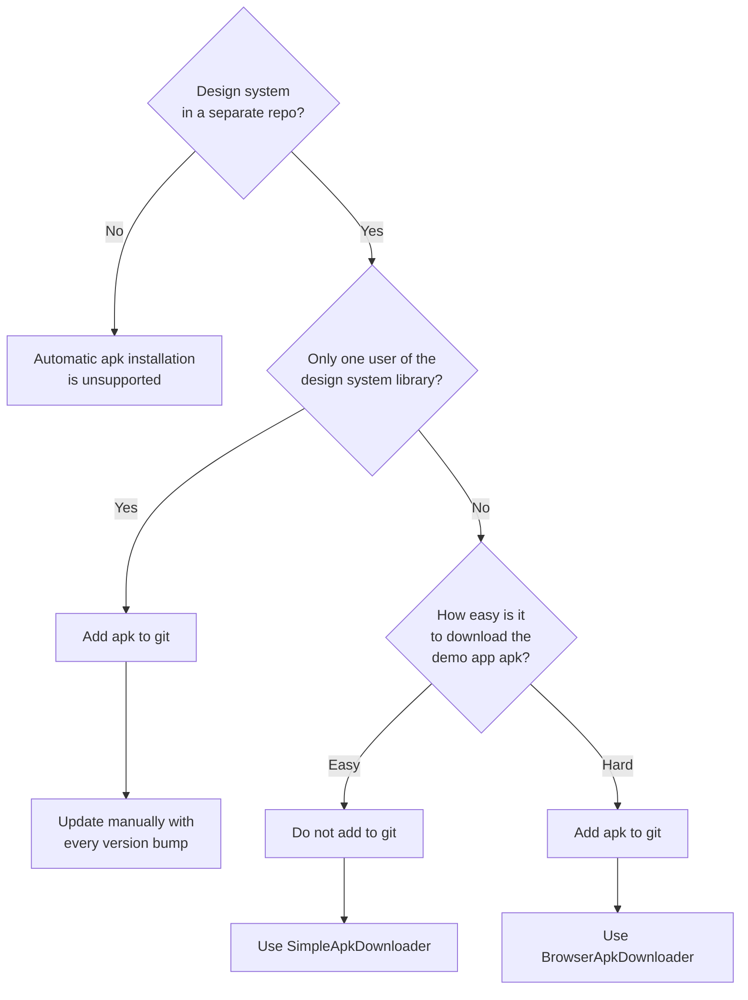

# Kelp

[](https://proandroiddev.com/kelp-plugin-for-android-studio-4374127939aa)

[](https://plugins.gradle.org/plugin/ru.ozon.kelp)

Kelp is an Android Studio plugin that enhances support for **custom design systems** written using Jetpack Compose.

[Introductory Medium Article](https://proandroiddev.com/kelp-plugin-for-android-studio-4374127939aa)

| Feature                                                                                                                                                                   | Screenshot                                                                                                                                                                                                       |
|---------------------------------------------------------------------------------------------------------------------------------------------------------------------------|------------------------------------------------------------------------------------------------------------------------------------------------------------------------------------------------------------------|
| 🔧 Customizable icon for<br> design system **component functions**                                                                                                        |  |
| 🎨 DS **icons** in the code completion<br> and gutter (where breakpoints are),<br> like with `R.drawable`                                                                 |                      |
| 🌈 **Colors** from DS palette in <br>the code completion and<br> gutter (where breakpoints are),<br> like with `R.color`                                                  |                          |
| 📱 Installing the apk file of <br>the **demo app** (showcase app) on an Android <br>device, as well as navigating to the component <br>page in it via an Intention Action |                |
| 📱 The same via the gutter icons near **function declarations**                                                                                                           |                        |
| 🖼 **KDoc Images** Rendering                                                                                                                                              |            |
| ⌨️ Handy **live templates**<br>(customizable; after applying, automatically opens code completion popup)                                                                  |                      |

These features enable users of your custom design system to develop UI **faster and easier**.
<!--
-- Plugin description --
Kelp is an Android Studio plugin that enhances support for **custom design systems** written using Jetpack Compose.

- [Introductory Medium Article](https://proandroiddev.com/kelp-plugin-for-android-studio-4374127939aa)
- [Documentation](https://github.com/ozontech/kelp)

## Features:
1. 🔧 Customizable Icons for Component Functions
2. 🎨 Design System Icons
3. 🌈 Color Previews
4. 📱 Demo App Integration
5. 🖼️ KDoc Image Rendering
6. ⌨️ Live Templates

-- Plugin description end --
-->

## ⚒️ Customization
Plugin allows you to configure aforementioned features and adapt them to _your_ project by using `config.json` 
file (see below).

However, if your custom design system is part of a large project with unique requirements, it is _encouraged_ to fork
this repo and add/modify features needed only by your company's project.

Don't worry, it is **not at all hard** to do it! You can create many powerful and incredibly useful features to increase 
developer happiness and productivity. These are some of the resources that will help you on your journey:
1. [IntelliJ Platform SDK](https://plugins.jetbrains.com/docs/intellij/welcome.html)
2. [Intellij IDEA GitHub repo](https://github.com/JetBrains/intellij-community) — use search to find examples of desired functionality
3. [The JetBrains Platform Slack community](https://plugins.jetbrains.com/slack) — ask the community

## 🖼 KDoc Images Rendering
Until this [issue](https://youtrack.jetbrains.com/issue/KTIJ-13687/KDoc-support-inline-images) is resolved,
Android Studio cannot render images referenced in KDoc.

This plugin ✨automatically✨ fixes this behaviour.

However, KDoc image syntax does not support specifying image size. This plugin introduces new syntax to achieve this:
```kotlin
/**
 * 
 * 
 * 
 * 
 * 
 * Space is not necessary but is used for readability.
 */
fun Button()
```

This feature is especially useful for design system creators and users — it increases **discoverability** of ds
components, allowing users to instantly preview them, for example, in code completion menu.

## 🌈 Color Previews
For this feature to work, you need to implement your color system like this:
```kotlin
class MyColors(
  val primary: Color,
  val secondary: Color,
  val accent: Color,
) {
  /**
   * This class MUST have this structure and name.
   * It MUST be placed here.
   * You can create it manually or autogenerate it using code generators.
   */
  private class KelpColorPreview {
    /**
     * The pattern is "name_lightColor_darkColor"
     * If you don't have a dark theme, you MUST set `darkColor`
     * to be the same as `lightColor`, then it won't be rendered.
     * 
     * Colors MUST be in ARGB:
     * The format of an ARGB hexadecimal color is AARRGGBB. 
     * AA is the alpha channel. It represents the opacity of the color. 
     * RR is the red value, GG is the green, and BB is the blue.
     * 
     * If your colors are in RGB format, just add FF to them, 
     * representing no transparency.
     */
    val primary_FFD0BCFF_FF6650A4 = Unit
    val secondary_12CCC2DC_FF625B71 = Unit
    val accent_FFEFB8C8_FF7D5260 = Unit
  }
}

// Another example:
class MyColors2 {
  var primary: Color by mutableStateOf(Color.Red)
  val secondary: Color = TODO()

  private class KelpColorPreview {
    val primary_FFD0BCFF_FF6650A4 = Unit
    val secondary_12CCC2DC_FF625B71 = Unit
  }
}
```

Optionally, Kelp also supports color tokens.
To enable, set `enumColorTokensEnabled` in `config.json` (see below)

More info about color tokens — [here](https://cs.android.com/androidx/platform/frameworks/support/+/androidx-main:compose/material3/material3/src/commonMain/kotlin/androidx/compose/material3/ColorScheme.kt;l=879?q=ColorSchemeKeyTokens&ss=androidx%2Fplatform%2Fframeworks%2Fsupport).

```kotlin
enum class MyColorTokens {
  Primary,
  Secondary,
  Accent,
  ;

  private class KelpColorPreview {
    val Primary_FFD0BCFF_FF6650A4 = Unit
    val Secondary_12CCC2DC_FF625B71 = Unit
    val Accent_FFEFB8C8_FF7D5260 = Unit
  }
}
```
Using this convention, there is **no need** to connect a configuration file with 
color values to the plugin per project.

> [!WARNING]  
> Until [this issue](https://youtrack.jetbrains.com/issue/GRZ-4351) is resolved, **Grazie Pro** plugin
> is incompatible with color previews in the gutter.
>
> Please, disable the Grazie Pro plugin if you want to use this feature.

## ⌨️ Live templates
These are prebuilt templates that are in the default `config.json` located below:
- `dt` — `DsTheme.`
- `dtc` — `DsTheme.colors.`
- `dtt` — `DsTheme.typography.`
- `dti` — `DsTheme.icons.`
- `rmso` — `var/val name by remember { mutableStateOf(false/null/0/0f) }`

Replace abbreviations, package and class names with your own.

You can add your own templates: just [export](https://www.jetbrains.com/help/idea/2024.1/sharing-live-templates.html#the-quick-way-copy-and-paste) 
them from the IDE and manually convert xml to json.

All templates are shared with your teammates through git (in contrast with the IDE templates).

## 🧪 Experimental support for IntelliJ IDEA
Kelp plugin supports IntelliJ IDEA in addition to Android Studio.

> [!WARNING]  
> However, IntelliJ IDEA support is experimental and can be **dropped** anytime. **DO NOT** rely on it.

## 📦 Installation

1. In <kbd>Settings/Preferences</kbd> > <kbd>Plugins</kbd> > <kbd>⚙️</kbd> > <kbd>Manage Plugin Repositories...</kbd> add the following url
   ```
   https://github.com/ozontech/kelp/releases/download/ideRepo/updatePlugins.xml
   ```
2. Close this window, select "Marketplace", type "kelp" into the search box and click "Install" ([full tutorial](https://www.jetbrains.com/help/idea/managing-plugins.html#repos))
3. _(Optional)_ If you want to notify developers about the need to install this plugin, 
create this file `/.idea/externalDependencies.xml`, add it to git, and paste this in the file:
    ```xml
    <?xml version="1.0" encoding="UTF-8"?>
    <project version="4">
      <component name="ExternalDependencies">
        <plugin id="ru.ozon.ideplugin.kelp" min-version="1.0.0" max-version="1.0.0" />
      </component>
    </project>
    ```
    You can read more about it [here](https://www.jetbrains.com/help/idea/managing-plugins.html#required-plugins).
4. Open the project you want to use this plugin with, create this file:
  `/.idea/kelp/config.json`, and add it to git.
5. Paste this content into it (without comments, they are unsupported in JSON):

<details>
<summary>Without comments</summary>

```json
{
  "componentFunHighlighting": {
    "functionFqnPrefix": "com.your.designsystem.package.components.",
    "functionSimpleNamePrefix": "Ds"
  },
  "colorPreview": {
    "codeCompletionEnabled": true,
    "gutterEnabled": true,
    "enumColorTokensEnabled": true
  },
  "iconsRendering": {
    "codeCompletionEnabled": true,
    "gutterEnabled": true,
    "containerClassName": "com.your.designsystem.package.DsIcons",
    
    "propertyNameFilter": {
      "startsWith": ["ic_"],
      "doesNotStartWith": ["allIconsAsList", "otherProperty"]
    },
    
    "propertyToResourceMapper": {
      "addPrefix": "ic_",
      "convertToSnakeCase": true
    }
  },
  "demoApp": {
    "intentionName": "🚀 Open in MY CUSTOM design system demo app",
    "functionFqnPrefix": "com.your.designsystem.package.components.",
    "functionSimpleNamePrefix": "Ds",
    "appPackageName": "com.your.designsystem.package.demo",
    "componentDeeplink": "yourscheme://component/DS_COMPONENT_FQN_DEEPLINK_PLACEHOLDER",
    "apkInstallation": true
  },
  "liveTemplates": [
    {
      "abbreviation": "dt",
      "text": "com.your.designsystem.DsTheme.$CODE_COMPLETION$",
      "description": "Writes \"DsTheme.\"",
      "variables": [{ "name": "CODE_COMPLETION", "expression": "complete()" }]
    },
    {
      "abbreviation": "dtc",
      "text": "com.your.designsystem.DsTheme.colors.$CODE_COMPLETION$",
      "description": "Writes \"DsTheme.colors.\"",
      "variables": [{ "name": "CODE_COMPLETION", "expression": "complete()" }]
    },
    {
      "abbreviation": "dtt",
      "text": "com.your.designsystem.DsTheme.typography.$CODE_COMPLETION$",
      "description": "Writes \"DsTheme.typography.\"",
      "variables": [{ "name": "CODE_COMPLETION", "expression": "complete()" }]
    },
    {
      "abbreviation": "dti",
      "text": "com.your.designsystem.DsTheme.icons.$CODE_COMPLETION$",
      "description": "Writes \"DsTheme.icons.\"",
      "variables": [{ "name": "CODE_COMPLETION", "expression": "complete()" }]
    },
    {
      "abbreviation": "rmso",
      "text": "$VAL_TYPE$ $NAME$ by androidx.compose.runtime.remember { androidx.compose.runtime.mutableStateOf($VALUE$) }",
      "description": "Creates mutableStateOf",
      "reformat": true,
      "variables": [
        { "name": "VAL_TYPE", "expression": "enum(\"var\", \"val\")" },
        { "name": "NAME" },
        { "name": "VALUE", "expression": "enum(\"false\", \"null\", \"0\", \"0f\")" }
      ],
      "context": ["KOTLIN_CLASS", "KOTLIN_STATEMENT", "KOTLIN_TOPLEVEL"]
    }
  ]
}
```
</details>

```json5
{
  // If you want to disable some of these features, just don't include their sections in your json file.
  
  // Replacing the default icon of design system components
  // in the code completion with a customizable icon
  // Custom icon MUST be 
  // 1. an svg 
  // 2. with size — 40x40
  // 3. placed here: /.idea/kelp/dsComponentFunIcon.svg
  // 4. optionally, a dark version can be added : /.idea/kelp/dsComponentFunIcon_dark.svg
  "componentFunHighlighting": {
    // custom icon will be added to all functions in this package
    "functionFqnPrefix": "com.your.designsystem.package.components.",
    "functionSimpleNamePrefix": "Ds" // optional
  },

  // Rendering design system colors in the code completion and gutter (where breakpoints are). 
  // Like with regular Android resources.
  "colorPreview": {
    "codeCompletionEnabled": true,
    "gutterEnabled": true,
    // optional, color tokens from enum class
    "enumColorTokensEnabled": true,
  },
  
  // Rendering design system icons in the code completion and gutter (where breakpoints are). 
  // Like with regular Android resources.
  // This feature:
  // 1. scans the fields of `containerClassName`
  // 2. filters them using `propertyNameFilter`
  // 3. applies `propertyToResourceMapper`
  // 4. retrieves an icon by the resulting name from the xml that is available in the project
  // or it's dependencies and places this icon in the code completion and gutter.
  "iconsRendering": {
    "codeCompletionEnabled": true,
    "gutterEnabled": true,
    // class with a lot of properties that return icons and are named as icons
    "containerClassName": "com.your.designsystem.package.DsIcons",
    
    // optional: filters out properties that do not represent an icon
    "propertyNameFilter": {
      // optional: only properties with this prefix will be considered as an icon
      "startsWith": ["ic_"],
      // optional: all properties with this prefix will be skipped
      "doesNotStartWith": ["allIconsAsList", "otherProperty"]
    },
    
    // maps property names to drawable resource names
    "propertyToResourceMapper": {
      "addPrefix": "ic_", // optional
      "convertToSnakeCase": true // optional; e.g. "AddAccount" -> "add_account"
    }
  },
  
  // Opening the component page in the demo app via an Intention Action
  "demoApp": {
    // optional: custom name of the intention action
    "intentionName": "🚀 Open in MY CUSTOM design system demo app",
    "functionFqnPrefix": "com.your.designsystem.package.components.",
    "functionSimpleNamePrefix": "Ds", // optional
    // package name of the demo app
    "appPackageName": "com.your.designsystem.package.demo",
    // deeplink that will be used to open a component page in the demo app.
    // DS_COMPONENT_FQN_DEEPLINK_PLACEHOLDER will be replaced with
    // the fully qualified name of the 
    // composable function, e.g. com.your.designsystem.package.components.Badge
    "componentDeeplink": "yourscheme://component/DS_COMPONENT_FQN_DEEPLINK_PLACEHOLDER",
    
    // optional
    // Installing (if not installed) the apk file
    // of the demo app (showcase app) on an Android device.
    
    // Demo app apk must be placed here with this name: /.idea/kelp/demoApp-VERSION_NAME.apk
    // For example: /.idea/kelp/demoApp-0.12.0.apk
    // The plugin will acquire the latest version from the apk file name (for example, 0.12.0).
    // If the app is not installed OR installed, but has a lower
    // version, the plugin will install the apk on the device.
    "apkInstallation": true,
    // optional
    // if apkInstallation == true, and there is no apk file found, launches this gradle command.
    // If you use Kelp Gradle Plugin, value must be "kelpCheckDemoAppApk"
    "apkDownloadGradleCommand": "kelpCheckDemoAppApk"
  },
  
  // Installs live templates into the IDE.
  // Useful for writing frequent code, like "MaterialTheme.colors." in just 3 keystrokes.
  // If you'd like add your own custom templates, export them and manually convert xml to json.
  // More: https://www.jetbrains.com/help/idea/2024.1/sharing-live-templates.html#the-quick-way-copy-and-paste
  "liveTemplates": [
    {
      "abbreviation": "dtc",
      "text": "com.your.designsystem.DsTheme.colors.",
      "description": "Writes \"DsTheme.colors.\""
    }
    // a list of useful templates is in the comment-less json
  ]
}
```
Now, press <kbd>⌘</kbd> + <kbd>S</kbd> (or <kbd>Ctrl</kbd> + <kbd>S</kbd>) to save the config.json and plugin will 
pick up new changes.

## 💥 Boom
Everything should work now!

If it doesn't, please, make sure that your `config.json` complies with 
[this](https://github.com/ozontech/kelp/blob/main/src/main/kotlin/ru/ozon/ideplugin/kelp/pluginConfig/KelpConfig.kt) format.

If that does not help, please, file [an issue](https://github.com/ozontech/kelp/issues/new/choose) in this repo.

## 🐘 Gradle Plugin
In addition to the IDE plugin, you can optionally use a companion gradle plugin.
It has 2 features/gradle tasks:
1. `kelpCheckIdePluginPresence` — Notifies if Kelp IDE plugin is absent or has an incorrect version. Can fail the build 
or print out a warning in the console.
2. `kelpCheckDemoAppApk` — Checks presence and version of the design system demo app apk. Downloads one if needed.

You can enable/disable these features independently.

## ⚙️ Configuration

[Kelp on Gradle Plugin Portal](https://plugins.gradle.org/plugin/ru.ozon.kelp)

Instructions for using `buildscript` are [here](https://plugins.gradle.org/plugin/ru.ozon.kelp).

```kotlin
// in build.gradle.kts of the app module that developers compile frequently to launch the app
plugins {
    id("ru.ozon.kelp") version "0.0.4"
}

kelp {
    idePluginAbsenceBehaviour = IdePluginAbsenceBehaviour.WARNING // NOTHING, WARNING, BUILD_FAIL
    requiredIdePluginVersion = "1.0.0"
    requiredDemoApkVersion = "1.3.0" // libs.versions.yourDesignSystem.get()
  
    // If your apk file can be downloaded without requiring to log in through web browser, use SimpleApkDownloader:
    setApkDownloader(
        SimpleApkDownloader(
            additionalErrorMsg = "Make sure to turn on the corporate VPN", // optional
            urlProvider = { version -> "https://example.com/demo-$version.apk" },
        ),
    )
  
    // In other cases, when manual interactions with the browser are required, use BrowserApkDownloader:
    setApkDownloader(BrowserApkDownloader { version -> "https://example.com/?query=android/$version" })
  
    // It does the following:
    // 1. Opens the provided url in the browser
    // 2. Asks the user to download an apk
    // 3. Listens for the appearance of the new ".apk" file in the downloads folder
    // 4. Copies it to the [destinationDir] with the [fileName].
  
    // You can also implement fully custom ApkDownloader:
    setApkDownloader(ApkDownloader { version, destinationDir, fileName, logger ->
        // ...
        file("your apk file").copyTo(destinationDir.resolve(fileName))
    })
}
```
<details>
<summary>Groovy</summary>

```groovy
import ru.ozon.kelp.IdePluginAbsenceBehaviour
import ru.ozon.kelp.downloaders.SimpleApkDownloader

kelp {
  idePluginAbsenceBehaviour = IdePluginAbsenceBehaviour.BUILD_FAIL
  requiredIdePluginVersion = "1.0.0"
  requiredDemoApkVersion = "1.3.0"

  def apkDownloader = new SimpleApkDownloader(
          "Make sure to turn on the corporate VPN",
          {},
          { version -> "https://example.com/demo-${version}.apk".toString() }
  )
  setApkDownloader(project, apkDownloader)
  setApkDownloader(project, new BrowserApkDownloader(null, { version -> "https://example.com/?query=android/{$version}".toString() }))
}
```

</details>

### 🚚 Choosing how to distribute the demo app apk
TLDR:

1️⃣. Is your design system located in a separate repo? If yes, then demo app installation is currently unsupported.

You can either:
- Include the demo app gradle module into your app's debug build. Then Kelp will just open a deeplink to your app.
- Expect developers to manually install the demo app.

2️⃣. How many clients use your design system library?

- If there is only one user and the design system library maintainer is responsible for version bumps in the client 
repo, you can add the latest demo app apk to git (possibly using git lfs) and update it with the new version every 
time you perform a version bump. This way, everybody will have the latest apk file in their `/.idea/kelp/apk` dir.

- If you have many clients, and they update the lib version themselves, you can advise them to integrate Kelp Gradle 
Plugin and configure it with either: `SimpleApkDownloader` or `BrowserApkDownloader`.

3️⃣. How easy is it to download the demo app apk?

> [!TIP]
> Consider pushing the demo app apk together with the design system lib `.aar` file to maven. 
> 
> This way, you can use `SimpleApkDownloader`.
> 
> <details>
> <summary>How?</summary>
> 
> ```kotlin
> tasks.named("publish") {
>     dependsOn(":app:assembleRelease")
> }
> 
> publishing {
>     publications {
>         register<MavenPublication>("release") {
>             from(components["release"])
>             groupId = "com.company.lib"
>             artifactId = "lib"
>             version = "1.0.0"
> 
>             artifact("$rootDir/app/build/outputs/apk/release/app-release.apk") {
>                 classifier = "demoApp"
>             }
>         }
>     }
> }
> ```
> 
> </details>

- If the demo app apk can be downloaded from the direct link (maybe it's only accessible from a corporate VPN), then
you can use `SimpleApkDownloader` and **do not** add the apk to git. This way, all developers working on the projects
that depend on your design system will experience automatic downloading of the latest demo app apk.

- Otherwise, if manual interactions with the browser are required to download the apk, use `BrowserApkDownloader` and
add the apk to git. 
<br><br>Then, when the project maintainer performs a version bump of the design system library and builds their app,
Kelp Gradle Plugin will detect the mismatch between the old demo app apk version and the new design system version. 
<br><br>It will open the browser and ask the maintainer to download the apk. Gradle plugin will automatically detect its
appearance in the _Downloads_ dir, rename and copy it to the project. 
<br><br>Finally, the project maintainer will commit the version bump changes _along_ with the new apk to the git.
<br><br>In this case, `BrowserApkDownloader` simplifies the task of updating the design system to the new version. Project 
maintainers do not have to go to the design system docs to acquire the apk downloading link and manually place the apk 
into the project.

## License

```
Copyright © 2023 LLC "Internet Solutions"

Licensed under the Apache License, Version 2.0 (the "License");
you may not use this file except in compliance with the License.
You may obtain a copy of the License at

http://www.apache.org/licenses/LICENSE-2.0

Unless required by applicable law or agreed to in writing, software
distributed under the License is distributed on an "AS IS" BASIS,
WITHOUT WARRANTIES OR CONDITIONS OF ANY KIND, either express or implied.
See the License for the specific language governing permissions and
limitations under the License.
```
